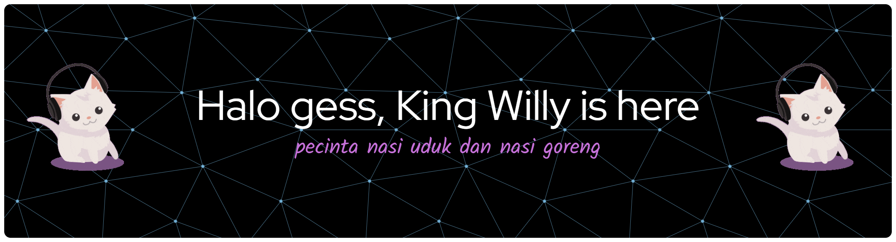

<h2 align="center">"Coding is my quest, Coffee is my mana potion ☕⚡"</h2>

---

## 🧑‍💻 Character Info  

<p align="center">
  
</p>

### 🧾 Character Status  

| Attribute        | Value                                                                 |
| ---------------- | --------------------------------------------------------------------- |
| 🎯 **Class**     | 🧑‍💻 Developer ⚔️ \| Explorer of Code 🗺️                                   |
| 🏆 **Level**     | ⭐ 25 (Experienced Adventurer)                                        |
| ❤️ **HP**        |  |
| 🔵 **Mana**      |  |
| 🟡 **EXP**       |  |
| 🎒 **Inventory** | ☕ Kopi \| 💻 Laptop \| 📝 IDE \| 🔥 Semangat \| 🎧 Musik Coding        |

---

## ⚔️ Skills  

```diff
+ Web Development      ██████████░░ (90%)
+ PHP & MySQL          ████████░░░░ (75%)
+ JavaScript           ███████░░░░░ (65%)
+ Flutter              ██████░░░░░░ (55%)
+ Git/GitHub           █████████░░░ (80%)

```

🛠️ Tech Stack

<p align="left">
  <!-- Web Core -->
  
  
  
  
  
  
  <!-- Backend -->
  
  
  
  
  
  
  <!-- Mobile -->
  
  
  
  <!-- Tools & Version Control -->
  
  
  
  
  
  <!-- Others -->
  
  
</p>

📊 Game Stats

<p align="center">
  <!-- Main Stats -->
  
  
  <!-- Top Languages -->
  
</p>

<!-- Streak Stats -->
<p align="center">
  
</p>

<!-- Trophy -->
<p align="center">
  
</p>

🌐 Connect with Me

<p align="center">
  <a href="https://linkedin.com/in/yourprofile" target="_blank">
    
  </a>
  <a href="mailto:youremail@gmail.com">
    
  </a>
  <a href="https://github.com/WillyantoWu" target="_blank">
    
  </a>
  <a href="https://twitter.com/yourusername" target="_blank">
    
  </a>
  <a href="https://instagram.com/yourusername" target="_blank">
    
  </a>
  <a href="https://discord.gg/yourserver" target="_blank">
    
  </a>
  <a href="https://youtube.com/@yourchannel" target="_blank">
    
  </a>
  <a href="https://yourportfolio.com" target="_blank">
    
  </a>
</p>
 ```
